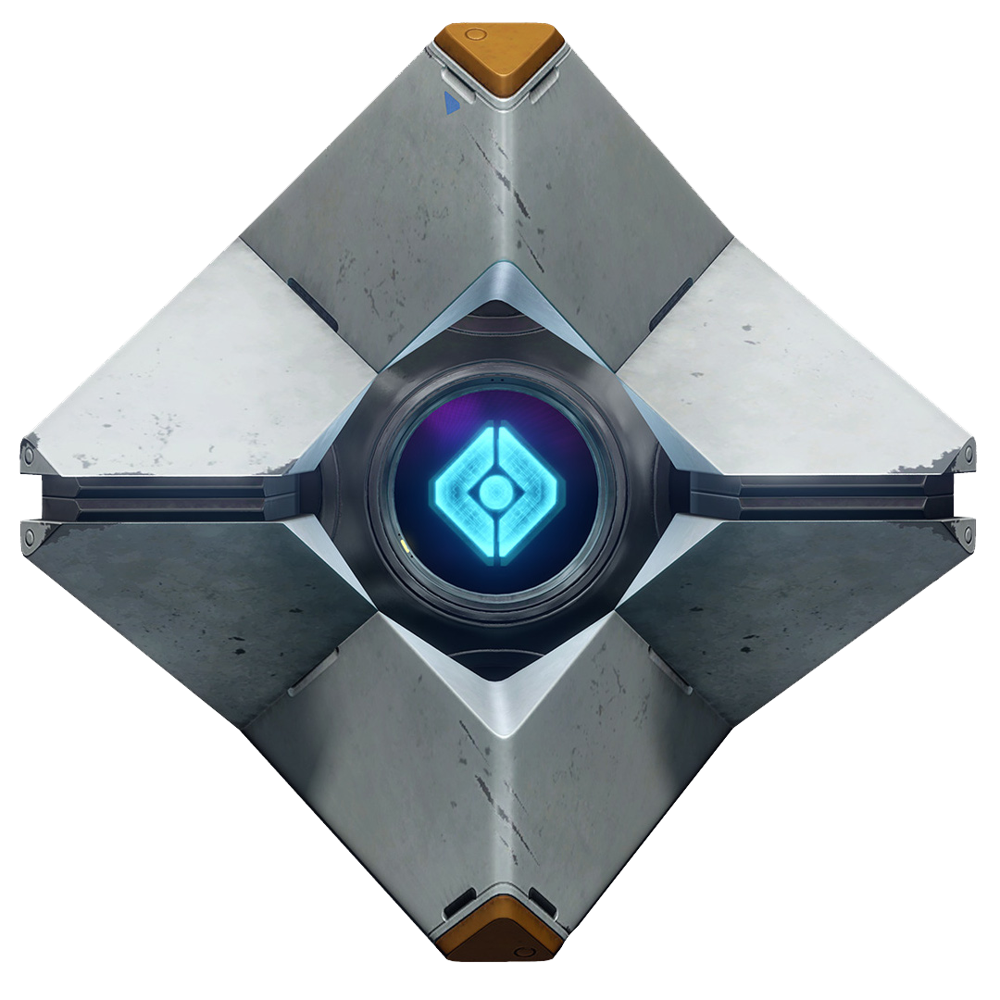

<br/>
<p align="center">
  <a href="https://github.com/LitSarah/D2-Shopper">
    
  </a>

  <h3 align="center">D2 Shopper</h3>

  <p align="center">
    A Discord Bot to let your clan know if they can buy what they're missing
    <br/>
    <br/>
    <a href="https://github.com/LitSarah/D2-Shopper/issues">Report Bug</a>
    .
    <a href="https://github.com/LitSarah/D2-Shopper/issues">Request Feature</a>
  </p>
</p>

     

## Table Of Contents

- [About the Project](#about-the-project)
- [Getting Started](#getting-started)
  - [Prerequisites](#prerequisites)
  - [Installation](#installation)
  - [Permissions](#permissions)
- [Usage](#usage)
- [Roadmap](#roadmap)
- [Built With](#built-with)
- [Contributing](#contributing)
- [License](#license)
- [Authors](#authors)
- [Acknowledgements](#acknowledgements)

## About The Project

D2 Shopper is a Discord bot that will show your clan members if anyone is selling a mod or exotic armor that they are missing.

## Getting Started

Here's how to add the D2 Shopper bot to your Discord server.

### Prerequisites

- Manage Server permissions on the Discord server the bot is being added to

### Installation (Host Your Own)

1. Download the code to a local machine, [Replit](https://replit.com/), or a VPS
2. Run `npm ci` in the code's root folder
   - If running on a Mac, you may need to run `npm config set python python3` to resolve an error in SQLite3's dependencies
3. Create a Discord Application and related bot in the [Discord Developer Portal](https://discord.com/developers/applications)
4. Add the bot to your server with the following scopes and permissions (see the [Permissions](#permissions) section for what they do):
   - Scopes
     - `bot`
     - `application.commands`
   - Permissions
     - Read Messages/View Channels
     - Send Messages
     - Embed Links
     - Use Slash Commands
5. Create an app with Bungie in the [Bungie Developer Portal](https://www.bungie.net/en/Application)
6. Add the following environment variables to a `.env` file at the root of the project:
   - `DISCORD_TOKEN` - the token for the Discord bot you created
   - `CLIENT_ID` - the application ID for the Discord app you created
   - `GUILD_ID` - the ID of the server the bot will be used on
   - `BUNGIE_TOKEN` - the API key for the Bungie app you created
7. Run `npm test` to run unit tests and make sure the Bungie API is working properly.
8. Run `npm run build` to deploy the commands to the server you specified with `GUILD_ID`
9. Run `npm start` to start up the bot and be able to interact with it from Discord

### Permissions

- `applications.commands` - Create and modify slash commands
- `Read Messages/View Channels` - ability to monitor for commands
- `Send Messages` - ability to send messages
- `Embed Links` - ability to add embeds and links to external sites like [light.gg](https://www.light.gg/)
- `Use Slash Commands` - ability to use slash commands

## Usage

```
/profile {name}
```

Displays information about the player queried, like Bungie Name, created date, and Bungie ID.

```
/clan {name}
```

Displays information about the clan queried, like name, call sign, and members.

```
/vendor [Xur, Banshee, Ada]
```

Displays information about the vendor selected.

## Roadmap

See the [open issues](https://github.com/LitSarah/D2-Shopper/issues) for a list of proposed features (and known issues).

## Built With

- Node.js
- Discord.js
- Axios

## Contributing

Contributions are what make the open source community such an amazing place to be learn, inspire, and create. Any contributions you make are **greatly appreciated**.

- If you have suggestions for adding or removing projects, feel free to [open an issue](https://github.com/LitSarah/D2-Shopper/issues/new) to discuss it, or directly create a pull request after you edit the _README.md_ file with necessary changes.
- Please make sure you check your spelling and grammar.
- Create individual PR for each suggestion.
- Please also read through the [Code Of Conduct](https://github.com/LitSarah/D2-Shopper/blob/main/CODE_OF_CONDUCT.md) before posting your first idea as well.

### Creating A Pull Request

1. Fork the Project
2. Create your Feature Branch (`git checkout -b feature/AmazingFeature`)
3. Commit your Changes (`git commit -m 'Add some AmazingFeature'`)
4. Push to the Branch (`git push origin feature/AmazingFeature`)
5. Open a Pull Request

## License

Distributed under the GNU GPLv3 License. See [LICENSE](https://github.com/LitSarah/D2-Shopper/blob/main/LICENSE.md) for more information.

## Authors

- **Sarah Little** - _[BOS] Leader_ - [Sarah Little](https://github.com/LitSarah/) - _Main author_

## Acknowledgements

- [ImgShields](https://shields.io/)
